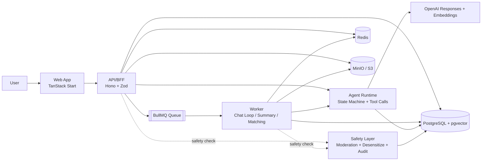

# Agent Chat 架构图（MVP）

## 系统架构图

```mermaid
flowchart LR
  U[User] --> W[Web App\nTanStack Start]
  W --> A[API/BFF\nHono + Zod]
  A --> R[Agent Runtime\nState Machine + Tool Calls]
  A --> DB[(PostgreSQL + pgvector)]
  A --> RE[(Redis)]
  A --> S3[(MinIO / S3)]

  Q[[BullMQ Queue]] --> WK[Worker\nChat Loop / Summary / Matching]
  A --> Q
  WK --> DB
  WK --> RE
  WK --> S3
  WK --> R

  R --> OAI[OpenAI Responses + Embeddings]
  R --> DB

  A -.safety check.-> SAF[Safety Layer\nModeration + Desensitize + Audit]
  WK -.safety check.-> SAF
  SAF --> DB
```

## 说明

1. `Web` 只负责展示和交互，业务编排都进 `API/BFF`。
2. `Agent Runtime` 封装状态机、记忆策略、工具调用。
3. `Worker` 负责异步长任务，避免阻塞 API。
4. `Safety Layer` 作为横切层，覆盖 API 和 Worker 的输入输出。
