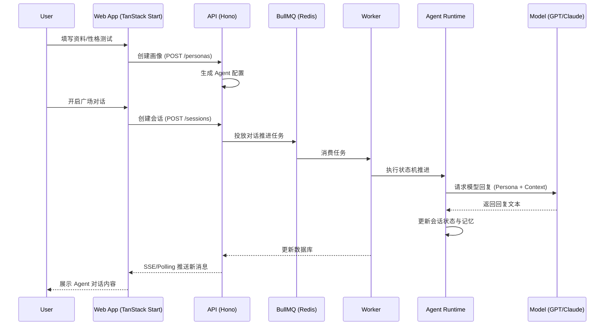
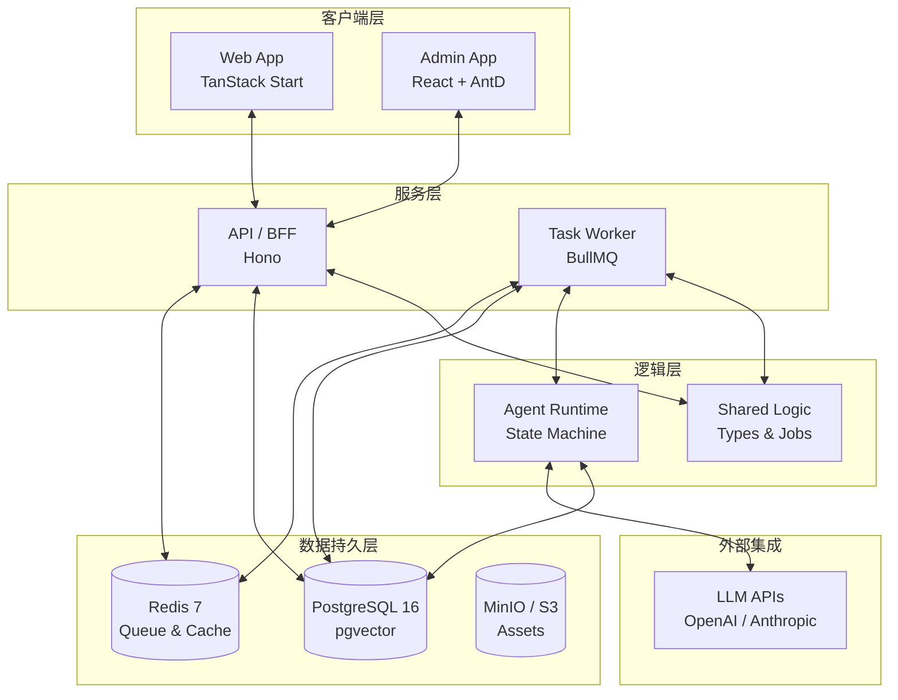
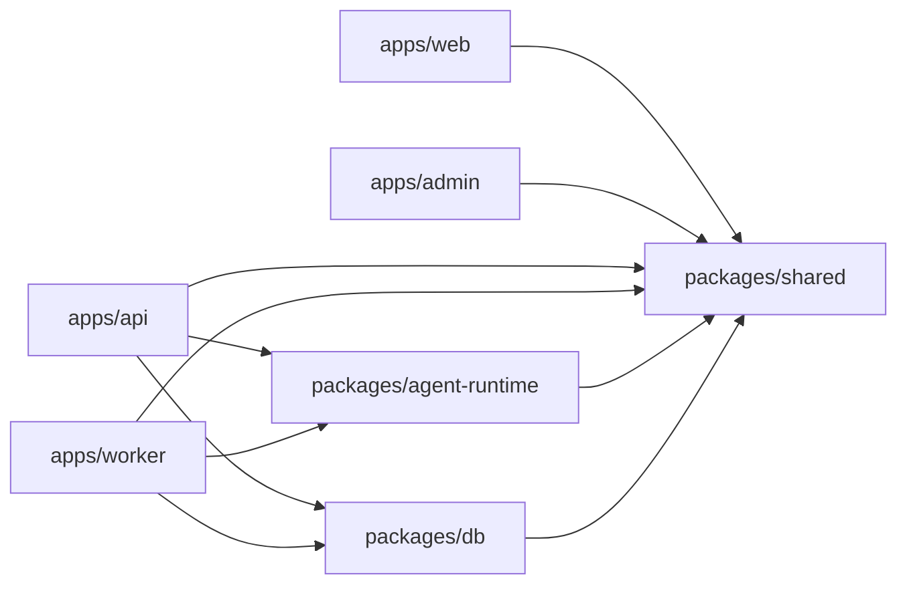
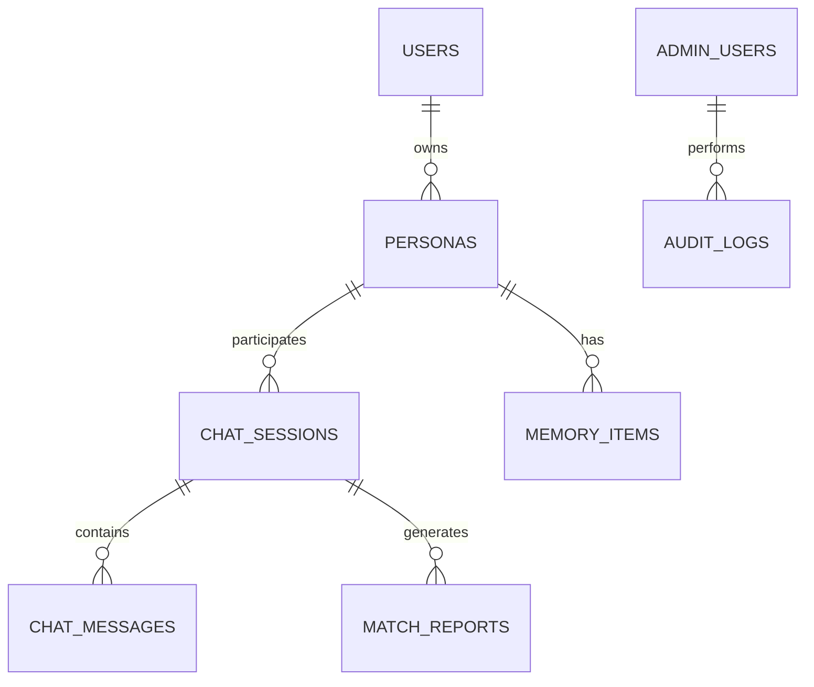

# Agent Chat 架构图集

## 1. 业务流程图

```mermaid
sequenceDiagram
    participant U as User
    participant W as Web App (TanStack Start)
    participant A as API (Hono)
    participant Q as BullMQ (Redis)
    participant WK as Worker
    participant R as Agent Runtime
    participant LLM as Model (GPT/Claude)

    U->>W: 填写资料/性格测试
    W->>A: 创建画像 (POST /personas)
    A->>A: 生成 Agent 配置
    U->>W: 开启广场对话
    W->>A: 创建会话 (POST /sessions)
    A->>Q: 投放对话推进任务
    Q->>WK: 消费任务
    WK->>R: 执行状态机推进
    R->>LLM: 请求模型回复 (Persona + Context)
    LLM-->>R: 返回回复文本
    R->>R: 更新会话状态与记忆
    WK-->>A: 更新数据库
    A-->>W: SSE/Polling 推送新消息
    W-->>U: 展示 Agent 对话内容
```

## 2. 系统架构图 (Technical Stack)

```mermaid
flowchart TB
    subgraph ClientLayer [客户端层]
        Web[Web App\nTanStack Start]
        Admin[Admin App\nReact + AntD]
    end

    subgraph ServiceLayer [服务层]
        API[API / BFF\nHono]
        Worker[Task Worker\nBullMQ]
    end

    subgraph LogicLayer [逻辑层]
        Runtime[Agent Runtime\nState Machine]
        Shared[Shared Logic\nTypes & Jobs]
    end

    subgraph DataLayer [数据持久层]
        DB[(PostgreSQL 16\npgvector)]
        Redis[(Redis 7\nQueue & Cache)]
        S3[(MinIO / S3\nAssets)]
    end

    subgraph External [外部集成]
        LLM[LLM APIs\nOpenAI / Anthropic]
    end

    Web <--> API
    Admin <--> API
    API <--> Redis
    API <--> DB
    Worker <--> Redis
    Worker <--> DB
    Worker <--> Runtime
    Runtime <--> LLM
    Runtime <--> DB
    API <--> Shared
    Worker <--> Shared
```

## 3. Monorepo 模块依赖关系

```mermaid
flowchart LR
    apps/web --> packages/shared
    apps/admin --> packages/shared
    apps/api --> packages/shared
    apps/api --> packages/db
    apps/api --> packages/agent-runtime
    apps/worker --> packages/shared
    apps/worker --> packages/db
    apps/worker --> packages/agent-runtime
    packages/agent-runtime --> packages/shared
    packages/db --> packages/shared
```

## 4. 核心实体 ER 图 (简版)

```mermaid
erDiagram
    USERS ||--o{ PERSONAS : owns
    PERSONAS ||--o{ CHAT_SESSIONS : participates
    CHAT_SESSIONS ||--o{ CHAT_MESSAGES : contains
    PERSONAS ||--o{ MEMORY_ITEMS : has
    CHAT_SESSIONS ||--o{ MATCH_REPORTS : generates
    ADMIN_USERS ||--o{ AUDIT_LOGS : performs
```
