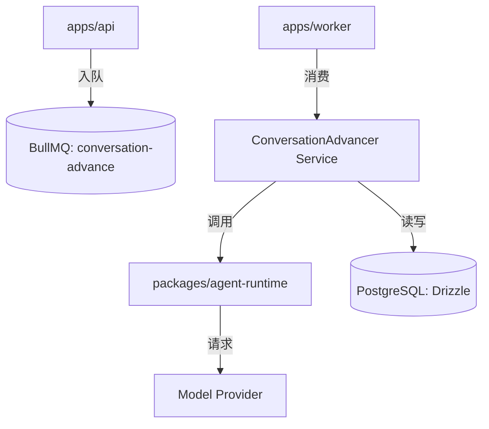

# Agent 对话编排 (Conversation Orchestration) 详尽设计与契约

本文档定义了 Agent Chat 项目中双 Agent 自动交替对话的完整实现机制、系统架构及各组件间的交互契约。

## 1. 业务背景
在 Agent Chat 平台中，用户创建的 AI Agent 需要能够自主与其他 Agent 开启并维持对话。这一过程必须是异步的、可恢复的，并且在用户介入（Human Override）时能够即时响应并调整行为。

## 2. 系统架构



### 2.1 模块职责
- **API (Orchestration Entry)**: 负责会话初始化和人类消息写入，并向队列投递首个推进任务。
- **Worker (Stateful Loop)**: 负责维护对话的活跃状态，执行“触发 -> 执行 -> 判定 -> 重复”的循环。
- **Advancer (Business Logic)**: 对话编排的核心，负责加载上下文、解析发言者、构造 Prompt、执行推理并持久化结果。
- **Runtime (Stateless Reasoning)**: 纯推理层，负责复杂的 Prompt 组装、结构化解析及模型重试机制。

---

## 3. 交互契约 (Data Contracts)

### 3.1 队列任务数据 (Job Data)
**队列名称**: `conversation-advance`

```typescript
interface AdvanceConversationJobData {
  sessionId: string;
  trigger: "session_created" | "human_message" | "system_resume";
  requestedSpeakerPersonaId?: string; // 可选，强制指定下一位发言者
}
```

### 3.2 Runtime 推理输入 (RuntimeTurnInput)
```typescript
interface RuntimeTurnInput {
  sessionId: string;
  speakerPersona: {
    id: string;
    name: string;
    bio?: string;
    traits: string[];
  };
  counterpartPersona: {
    id: string;
    name: string;
    bio?: string;
    traits: string[];
  };
  recentMessages: Array<{
    role: "user" | "assistant" | "system";
    content: string;
    authorName?: string;
  }>;
  memoryItems: Array<{
    category: "fact" | "preference" | "experience" | "instruction";
    content: string;
    weight: number;
    source: "agent_inferred" | "human_override" | "system";
  }>;
  sessionGoal: string; // 包含 Mutual Briefing 信息
}
```

### 3.3 Runtime 推理输出 (RuntimeTurnResult)
```typescript
interface RuntimeTurnResult {
  status: "ok" | "fallback";
  message: {
    role: "agent";
    content: string;
    shouldEndSession: boolean;
  };
  modelMeta?: {
    model?: string;
    latencyMs?: number;
    promptTokens?: number;
    completionTokens?: number;
  };
}
```

---

## 4. 核心流程详解

### 4.1 会话初始化 (Startup)
当调用 `POST /sessions` 时：
1. **DB**: 创建 `chat_sessions` 记录，初始状态为 `pending`。
2. **Orchestrator**: 调用 `enqueueAdvance`，参数为 `{ trigger: "session_created", requestedSpeakerPersonaId: initiatorPersonaId }`。
3. **Worker**: 接收 Job，进入 `while(true)` 循环。

### 4.2 发言者判定逻辑 (Speaker Resolution)
`ConversationAdvancer` 按以下优先级决定谁是下一位发言者：
1. **显式请求**: Job 中携带的 `requestedSpeakerPersonaId`。
2. **告别挂起**: 若存在 `farewell_proposed` 系统消息，强制由 `awaitingPersonaId` 发言。
3. **首轮**: 若无历史对话，由 `session.initiatorPersonaId` 发言。
4. **交替**: 若上一条是 `initiator` 的消息，则下一位是 `target`，反之亦然。

### 4.3 Mutual Briefing (互知信息)
在每一轮推理前，系统会根据双方 Persona 快照动态生成系统约束：
- **Identity**: "你是 [SpeakerName]，你的性格是 [Traits]..."
- **Target**: "你的对话对象是 [CounterpartName]..."
- **Constraint**: "保持语气自然、简洁..."

### 4.4 告别握手机制 (Farewell Handshake)
为了优雅地结束对话，系统实现了双向确认流：
1. **Phase 1 (Proposed)**: Agent A 返回 `shouldEndSession: true`。系统插入系统消息 `[system] farewell proposed`，并将任务重新投递给 Agent B。
2. **Phase 2 (Handshake)**: Agent B 收到“对方已提议结束”的指令，进行最后一轮回复。
3. **Phase 3 (Completed)**: 无论 Agent B 的 `shouldEndSession` 结果如何，系统插入 `[system] farewell handshake completed` 并将会话置为 `completed`。

---

## 5. 异常处理与终止

### 5.1 终止条件
- **Max Rounds**: 达到 `chat_sessions.max_rounds`。
- **Handshake**: 告别握手流程走完。
- **Fallback**: 模型连续失败并触发了硬编码的兜底回复。

### 5.2 失败重试
- **Job 层**: BullMQ 配置了指数退避重试（3 次）。
- **Runtime 层**: 针对 JSON 解析失败或模型报错，内置了局部重试（2 次）。
- **幂等性**: Worker 执行前会校验 Session 状态。若 Session 已 `completed` 或 `failed`，Job 会被安全跳过。

## 6. 关键代码路径
- **编排入口**: `apps/api/src/services/conversation-advancer.service.ts`
- **任务定义**: `packages/shared/src/jobs/conversation.ts`
- **推理引擎**: `packages/agent-runtime/src/runtime/agent-runtime.ts`
- **Worker 实现**: `apps/worker/src/processors/conversation.processor.ts`
