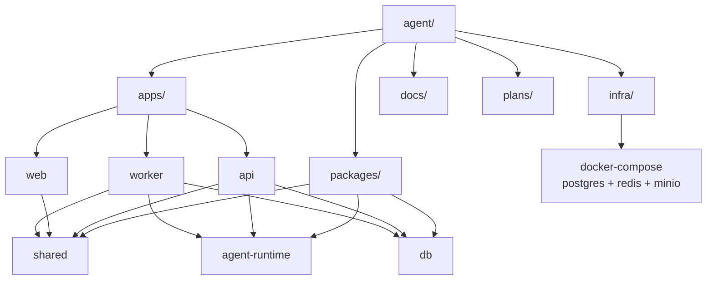

# Agent Chat 项目结构图（pnpm workspace）

## 结构关系图



## 目录树

```txt
agent/
  apps/
    web/
    api/
    worker/
  packages/
    agent-runtime/
    db/
    shared/
  infra/
    docker/
  docs/
  plans/
  package.json
  pnpm-workspace.yaml
  tsconfig.base.json
  .env.example
```
